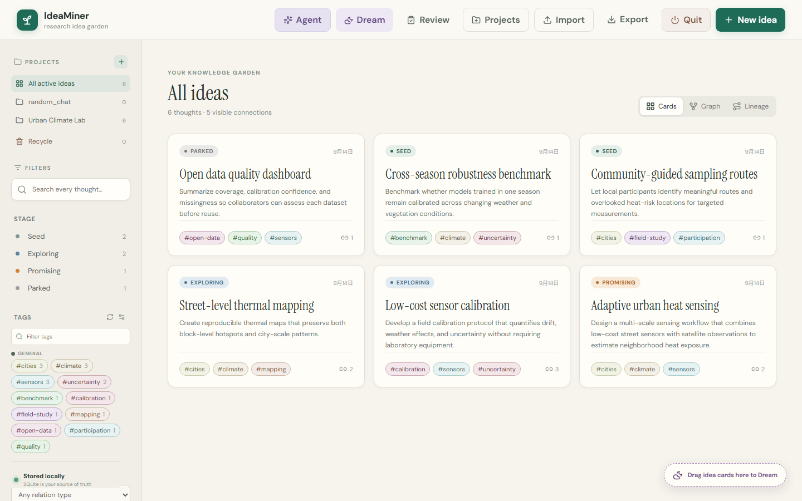

# IdeaMiner

IdeaMiner is a local-first research idea manager built with React, TypeScript, FastAPI, SQLite FTS5, and Cytoscape.js. It captures ideas without rewriting the original text, organizes them into projects, and visualizes how they develop and connect.

Your SQLite database is the canonical source of truth. The core application runs locally and does not require an account, cloud database, or API key.



_A privacy-safe example library. Your own ideas remain in the SQLite database beside your local installation._

## When IdeaMiner earns its place

- **A promising thought arrives before the project exists.** Capture it in `random_chat`; IdeaMiner preserves the original wording while you later refine it, tag it, and move it into a research project.
- **One hypothesis keeps branching.** Turn alternatives, experiments, evidence, and objections into linked descendant ideas, then use Lineage view to see how the reasoning evolved instead of losing it in a long document.
- **The interesting connection crosses project boundaries.** Drag several cards into Dream, add an optional question, and use an agent to propose a new synthesis while keeping every source idea traceable.
- **Your research must remain local.** Keep the canonical library in SQLite, reference nearby papers or code by file path without copying their contents, and write notes with Markdown and LaTeX.
- **A collaborator wants to build on your thinking.** Export a project as JSON so they can import and integrate its ideas and relations, or export readable Markdown for discussion.

For example: capture “Could prediction change with temporal scale?”, grow separate children for modeling, evaluation, and counterarguments, attach the relevant paper paths, and let the weekly review bring the most promising unfinished branch back into focus.

## Features

- Idea CRUD with immutable original captures and editable Markdown/LaTeX notes
- Projects, project groups, recycle bin, move/copy actions, and bulk cleanup
- Tags, tag groups, deterministic group colors, co-occurrence Tag Map, and bulk tag management
- FTS5 keyword search, filters, related-idea suggestions, graph view, and lineage tracking
- Scalable Focus browser with a compact navigator, stable reading pane, density control, and keyboard navigation
- Local-file references that store paths and metadata without embedding file contents
- JSON import/export and Markdown export
- Weekly review, local semantic discovery, and cross-project Dream synthesis
- Optional Agent workspace with separate OpenAI, Anthropic, DeepSeek, Qwen, and local profiles
- Optional MCP bridge for using the same library from Codex

## Quick start on Windows

### Requirements

Install these once:

- [Python 3.11 or newer](https://www.python.org/downloads/windows/) — enable **Add Python to PATH** during installation
- [Node.js LTS](https://nodejs.org/) — includes npm

Then:

1. Download and extract this repository, or clone it with Git.
2. Double-click **`start-ideaminer.bat`**.
3. On the first run, allow the setup window to create `.venv` and install the locked dependencies.
4. Keep the IdeaMiner command window open while using the app.

The browser normally opens at [http://127.0.0.1:5173](http://127.0.0.1:5173). If another IdeaMiner copy is running, the launcher automatically chooses free web/API ports and connects only to this folder's backend. The command window prints the exact database and addresses. Later starts skip installation and open much faster. To stop cleanly, use **Quit** in IdeaMiner or press `Ctrl+C` in its command window.

## Manual setup on Windows, macOS, or Linux

From a terminal in the repository:

```bash
python -m venv .venv
```

Activate the environment:

```powershell
# Windows PowerShell
.\.venv\Scripts\Activate.ps1
```

```bash
# macOS or Linux
source .venv/bin/activate
```

Install and run:

```bash
python -m pip install -r backend/requirements.txt
npm ci
python launcher.py
```

The coordinated launcher starts FastAPI on port 8000 and Vite on port 5173, opens the browser, and shuts both services down together.

## First launch and storage

IdeaMiner automatically creates `data/ideaminer.db` on first launch, including the built-in `random_chat` and `recycle` projects. That database, its backups, `.env` files, dependencies, and build artifacts are ignored by Git.

Never commit the `data` directory contents: they can contain idea text, agent history, file paths, and other private research material. The repository intentionally includes only `data/.gitkeep`.

For backups, stop IdeaMiner and copy `data/ideaminer.db` somewhere safe. For sharing selected knowledge with another IdeaMiner user, use **Export → JSON** and let the recipient use **Import**.

## Agent connections

The application works fully without an LLM. To use the optional Agent or Dream tools, open **Agent** and choose the **OpenAI**, **Anthropic**, **DeepSeek**, **Qwen**, or **Local** tab. Enter the key once, choose a model and thinking effort, leave **Remember this credential in the operating system vault** checked, and save the profile.

Each provider keeps its own endpoint, model, thinking effort, and credential, so switching tabs does not require retyping keys. Secrets live in the current operating-system user's credential vault—not SQLite, browser storage, the profile file, backups, or exports. Non-secret profile choices are stored beside the database. **Forget saved profile** removes one provider's saved settings and credential. The Local tab supports OpenAI-compatible Responses endpoints and an optional key.

The included `.env.example` is a reference list for unattended or portable configuration; IdeaMiner does not automatically load it. You can set those values in your shell or operating-system environment instead of saving an in-app profile.

Original `raw_text` captures are excluded from online Agent context. Selected working notes and explicitly selected compatible local files may be sent to the configured provider for a run.

### Advanced agent workflows

- **Grow an idea without overwriting its history:** open an idea, run **Elaborate**, and choose **Save as new**. The result becomes a child in the same project with a `develops-into` relation; choose **Update original** only when the response should replace the current working version.
- **Discover and record connections:** run the Agent in **Connect** mode over all ideas, one project, or a project group. It can propose typed relations with explanations; apply only the useful proposals so the graph—not a fragile reference such as “Idea #4”—remains the source of truth.
- **Dream across boundaries:** drag two to eight cards, even from different projects, into the **Dream** tray. Add an optional prompt such as “combine these into a testable study,” choose a destination project, and review the proposed descendants. Accepted results receive the `dreams` tag and `inspired-by` links to every source card.
- **Stress-test before committing:** use **Critique** to expose assumptions and missing evidence, or **Synthesize** to turn a cluster of ideas into a coherent direction. Agent-created ideas, edits, and relations remain proposals until you accept them.
- **Follow the idea track:** use **Lineage** for parent-to-descendant development, **Graph** for wider conceptual links, and stages plus the weekly **Review** to decide which branches should advance, pause, or reconnect.

Example: elaborate a broad hypothesis into separate modeling and evaluation children, connect the evaluation branch to a calibration idea from another project, then Dream those cards into a new experiment. The resulting idea retains visible links to its sources, so months later you can still reconstruct why it exists.

## Everyday workflow

- Create a project, or use `random_chat` for temporary captures.
- Write notes with Markdown and KaTeX (`$...$` inline and `$$...$$` for display equations).
- Use `develops-into` relations and the **Lineage** view to follow an idea track.
- Open **Tags → settings → Tag map** to see tag co-occurrence in the selected scope.
- Deleted ideas first move to **Recycle**. Deleting them there is permanent.
- Agent and Dream results remain reviewable proposals until you apply them.

## Import and export

**Export → JSON** produces a versioned library file containing groups, projects, ideas, original captures, tags, timestamps, and typed relations. Import previews conflicts and can skip, copy, or update matching ideas inside one SQLite transaction.

Markdown export is intended for reading. Local attachment contents are never bundled; exports contain only library records and references.

## Optional Codex integration

`ideaminer_mcp.py` is the stable stdio entry point for the included MCP server. The reusable Codex skill source is under `integrations/codex/ideaminer`. Point your local MCP configuration at this repository's Python interpreter and `ideaminer_mcp.py`, with the working directory set to the repository root.

The MCP bridge reads and writes the same SQLite database and supports projects, search, capture, editing with optimistic concurrency, typed relations, move/copy, attachments, and review checkpoints. It does not expose permanent deletion.

## Development

With the environment and packages installed:

```bash
# Backend tests
python -m pytest backend/tests -q

# Frontend development server only
npm run dev

# Type-check and production build
npm run build
```

Useful local addresses:

- Web interface: [http://127.0.0.1:5173](http://127.0.0.1:5173)
- API documentation: [http://127.0.0.1:8000/docs](http://127.0.0.1:8000/docs)
- Health check: [http://127.0.0.1:8000/api/health](http://127.0.0.1:8000/api/health)

## Architecture

- `src/` — React + TypeScript interface
- `backend/app/` — FastAPI routes, SQLite schema/migrations, search, agents, and MCP tools
- `backend/tests/` — API and MCP protocol tests
- `data/` — ignored local library state
- `launcher.py` — coordinated API/frontend lifecycle and in-app Quit support
- `integrations/` — optional Codex skill source

`ideas.raw_text` preserves the original capture. Editable content and revisions live separately. FTS5 indexes searchable text, while `idea_embeddings` is isolated so a different semantic-vector implementation can be added without changing idea records.

## Troubleshooting

- **Python was not found:** install Python 3.11+ and enable its PATH option, then reopen the launcher.
- **npm was not found:** install Node.js LTS and reopen the launcher.
- **PowerShell blocks activation:** activation is unnecessary when using `start-ideaminer.bat`; it calls the environment's Python directly.
- **Dependency installation failed:** confirm internet access, delete the incomplete `.venv` or `node_modules`, and run the launcher again.
- **A port is already in use:** quit any older IdeaMiner process using ports 8000 or 5173.
- **The browser did not open:** wait for the launcher to report readiness, then visit `http://127.0.0.1:5173` manually.

## License

This repository is a modified derivative of
[IdeaMiner](https://github.com/dykuang/idea-manager), originally created by
[Dongyang Kuang](https://github.com/dykuang).

The original project and this derivative are distributed under the
[Apache License 2.0](LICENSE).

- Original work: Copyright 2026 Dongyang Kuang.
- Modifications: Copyright 2026 JiaRu Wang.

The modifications in this repository include MiniMax integration, Paper Lab,
scholarly paper discovery, adaptive paper reasoning, reproduction planning,
and cross-disciplinary research analysis. The upstream project's Git history
and contributor attribution have been retained.
